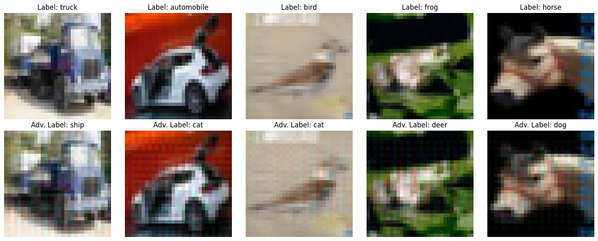
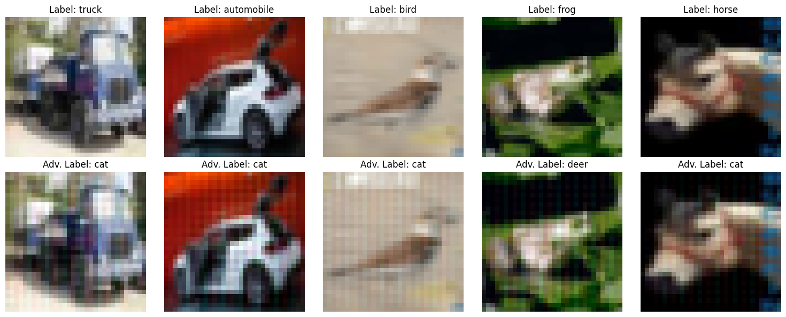
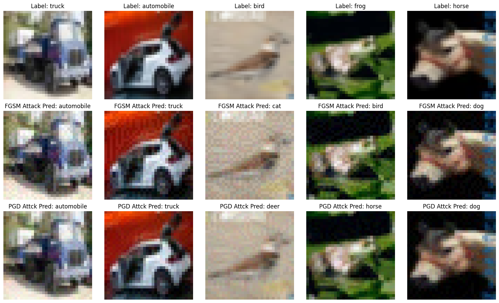

# Generating-Adversarial-Examples-with-Adversarial-Networks

## Introduction

This is an Implementation of paper ["Generating Adversarial Examples with Adversarial Networks"](https://arxiv.org/abs/1801.02610) in pytorch. The idea is to use a GAN to generate adversarial examples. We implemented the semi-whitebox attack in which we have the target model's weights during training but after that we don't need it.


## Target Model

The target model is resnet20 model from [henyaofo/pytorch-cifar-models](henyaofo/pytorch-cifar-models). The model is trained on CIFAR-10 dataset and has accuracy of 92.6.


## AdvGAN
AdvGAN is a generative adversarial network (GAN)-based method for generating adversarial examples to fool machine learning models. It consists of a generator that creates perturbations and a discriminator that distinguishes between real and adversarial samples. The goal is to generate perturbations that are both effective and natural-looking, making them difficult for the target model to detect. Unlike traditional methods like FGSM and PGD, AdvGAN does not require iterative gradient-based optimization at test time, making it more efficient. Once trained, the generator can quickly produce adversarial examples for any new input without direct access to the target model, enabling white-box-semi attacks. Additionally, AdvGAN can perform black-box attacks by training a substitute model that mimics the target model’s behavior, allowing it to generate effective perturbations even when the target model is unknown. This adaptability makes AdvGAN a powerful tool for adversarial attacks.

### Loss Functions

1. **Adversarial Loss ($L_{adv}$)**  
   - **Purpose**: Ensures the generated perturbation fools the target model. For untargeted attacks, it pushes the prediction away from the true class; for targeted attacks, it drives it toward a specific class.
   - **Formula (Untargeted Attack)**:
```math
L_{adv} = \max(\kappa, f(x + G(x))_y - \max_{i \neq y} f(x + G(x))_i)
```
   (Here, $f$ is the target model, $y$ is the true class, $G(x)$ is the perturbation, and $\kappa$ is a confidence margin.)
   - **Formula (Targeted Attack)**:
```math
L_{adv} = \max(\kappa, \max_{i \neq t} f(x + G(x))_i - f(x + G(x))_t)
```
   (where $t$ is the target class.)

2. **GAN Loss ($L_{GAN}$)**  
   - **Purpose**: Trains the generator $G$ to produce realistic perturbations, guided by a discriminator $D$ , keeping them visually imperceptible.
   - **Formula**:
```math
L_{GAN} = \mathbb{E}[\log D(x)] + \mathbb{E}[\log(1 - D(x + G(x)))]
```
   (Standard GAN loss, where $D$ distinguishes real from perturbed inputs.)

3. **Hinge Loss ($L_{hinge}$)**  
   - **Purpose**: Limits the magnitude of the perturbation to maintain stealthiness (e.g., under \( L_2 \) norm).
   - **Formula**:
```math
L_{hinge} = \mathbb{E}_x[max(0,||G(x)||_2 - c]
```
   (Measures the squared $L_2$ norm of the perturbation and $c$ is the maximum allowed magnitude.)

The total loss for the generator is a weighted combination: 
```math
L = L_{GAN} + \alpha L_{adv} + \beta L_{hinge}
```
 (where $\alpha$ and $\beta$ balance the terms.)
 
 This setup ensures effective attacks while keeping perturbations subtle. We changed this final formula and added $\gamma$ to balance the adversarial loss and other losses: 
```math
L = \gamma L_{GAN} + \alpha L_{adv} + \beta L_{hinge}
```

## Results

The hyperparameters can be seen in the notebook but apart from loss functions' coefficients, we used the same hyperparameters as the paper. We generate all adversarial examples for different attack methods under an $L_{\infty}$ bound of 8 on CIFAR-10

### AdvGAN Untargetted Semi-whitebox Attack

| Class      | Clean Accuracy | Adversarial Accuracy | Attack Success Rate |
|------------|----------------|----------------------|---------------------|
| Overall    | 92.59          | 8.23                 | 91.77               |
| airplane   | 93.70          | 1.40                 | 98.60               |
| automobile | 97.20          | 3.10                 | 96.90               |
| bird       | 90.10          | 13.10                | 86.90               |
| cat        | 85.20          | 34.90                | 65.10               |
| deer       | 92.90          | 3.50                 | 96.50               |
| dog        | 88.90          | 1.90                 | 98.10               |
| frog       | 94.40          | 0.50                 | 99.50               |
| horse      | 93.30          | 1.40                 | 98.60               |
| ship       | 95.70          | 15.50                | 84.50               |
| truck      | 94.50          | 7.00                 | 93.00               |




### AdvGAN Targetted Semi-whitebox Attack 

The target was cat.

| Class      | Clean Accuracy | Adversarial Accuracy | Attack Success Rate |
|------------|----------------|----------------------|---------------------|
| Overall    | 92.59          | 10.09                | 99.88               |
| airplane   | 93.70          | 0.00                 | 100.00              |
| automobile | 97.20          | 0.00                 | 99.90               |
| bird       | 90.10          | 0.40                 | 99.60               |
| cat        | 85.20          | 100.00               | 100.00              |
| deer       | 92.90          | 0.10                 | 99.90               |
| dog        | 88.90          | 0.30                 | 99.50               |
| frog       | 94.40          | 0.00                 | 100.00              |
| horse      | 93.30          | 0.10                 | 99.90               |
| ship       | 95.70          | 0.00                 | 100.00              |
| truck      | 94.50          | 0.00                 | 100.00              |




### Other Attack Methods

 The previous methods for generating adversarial examples are based on the gradient of the loss function of the model. We specifically compared FGSM and PGD to the advGAN method. They have a few problems such as:

 * The model weights should be known all the time.(white-box attack)
 * PGD is computationally expensive and can be time-consuming.
 * For higher success rate, the changes in input for FGSM will be detected by human eye.

 


 ### Comparison

| Attack Method       | Attack Success Rate |
|---------------------|---------------------|
| FGSM                | 81.51               |
| PGD                 | 95.68               |
| AdvGAN (Untargeted) | 91.77               |
| AdvGAN (Targeted)   | 99.88               |

## Model Checkpoint

The trained generator can be found and used in [checkpoints directory](./checkpoints)

```python
generator_best = Generator_CIFAR10_UNet().to(DEVICE)
generator_best.load_state_dict(torch.load("best_generator.pth", weights_only=True))
```


